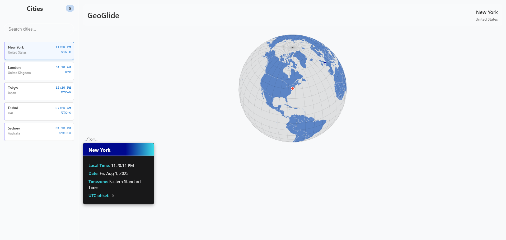

# GeoGlide

GeoGlide is an interactive Angular web application for visualizing world cities and their time zones. Users can search, add, and manage cities in a sidebar, view real-time local times, and explore locations on a 3D globe. The app features smooth sidebar animations, responsive mobile support, and a modern, visually appealing UI.

## Features

- **Animated Sidebar:** Add, remove, and select cities with smooth transitions.
- **City Search:** Quickly find and add cities to your list.
- **Real-Time Clocks:** See the current time, date, and UTC offset for each city.
- **3D Globe Visualization:** Explore cities on an interactive globe.
- **Responsive Design:** Sidebar collapses to a hamburger menu on mobile.
- **Drag & Drop:** Move city details and reorder city cards (using Angular CDK).
- **Modern UI:** Uses Angular standalone components and CSS effects like blur.

## Screenshots



## Getting Started

### Prerequisites

- [Node.js](https://nodejs.org/) (v18 or higher recommended)
- [Angular CLI](https://angular.io/cli) (v18)

### Installation

1. Clone the repository:

   ```sh
   git clone https://github.com/jaydenfarmer/geoglide.git
   cd geoglide
   ```

2. Install dependencies:

   ```sh
   npm install
   ```

3. Run the development server:
   ```sh
   ng serve
   ```
   Then open [http://localhost:4200](http://localhost:4200) in your browser.

## Usage

- Use the sidebar to search for and add cities.
- Click a city to view its details and see its location on the globe.
- On mobile, open the sidebar with the hamburger menu.
- Drag city cards or the city details popup to reposition them.

## Project Structure

- `src/app/app.component.*` - Main app shell and layout
- `src/app/components/city-sidebar/` - Sidebar for managing cities
- `src/app/components/city-card/` - Individual city cards
- `src/app/components/city-details/` - Draggable city details popup
- `src/app/components/globe/` - 3D globe visualization

## Technical Highlights

- Angular standalone components
- Angular Animations for smooth UI transitions
- Angular CDK DragDrop for drag-and-drop features
- Responsive CSS and modern UI design

## License

MIT

---

**GeoGlide** was built as a portfolio project to demonstrate modern Angular techniques, responsive design, and interactive data visualization.
